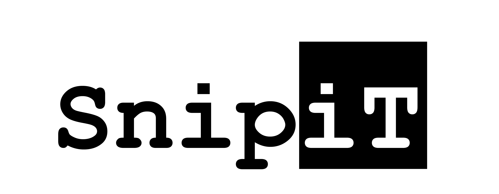

[![Contributors][contributors_shield]][contributors_url]
[![Forks][forks_shield]][forks_url]
[![Stargazers][stars_shield]][stars_url]
[![Issues][issues_shield]][issues_url]
[![project_license][license_shield]][license_url]
[![LinkedIn][linkedin_shield]][linkedin_url]

<div align="center">
  <a href="http://www.snipit-app.org/">
    
  </a>
<h3 align="center">Snipit</h3>
  <p align="center">
    Snipit is an agile cross-platform notation app. Each note consists of code blocks of TS React components, snippets. These snippets can have a range of features. Eg: Text, timer, calander, kanban tickets, todolist, table or a combination of any of them. Some of these snippets come out of the box but they can also be add by the community or prompted by an AI assistend. The goal is to make templates of notes that can be reused and opened with chron jobs.
    <br />
    <a href="https://github.com/miroaccgh/snipit/docs"><strong>Explore the docs »</strong></a>
    <br />
    <br />
    <a href="https://github.com/miroaccgh/snipit">View Demo</a>
    ·
    <a href="https://github.com/miroaccgh/snipit/issues/new?labels=bug&template=bug-report---.md">Report Bug</a>
    ·
    <a href="https://github.com/miroaccgh/snipit/issues/new?labels=enhancement&template=feature-request---.md">Request Feature</a>
  </p>
</div>

<details>
  <summary>Table of Contents</summary>
  <ol>
    <li>
      <a href="#about-the-project">About The Project</a>
      <ul>
        <li><a href="#built-with">Built With</a></li>
      </ul>
    </li>
    <li>
      <a href="#getting-started">Getting Started</a>
      <ul>
        <li><a href="#prerequisites">Prerequisites</a></li>
        <li><a href="#installation">Installation</a></li>
      </ul>
    </li>
    <li><a href="#usage">Usage</a></li>
    <li><a href="#roadmap">Roadmap</a></li>
    <li><a href="#contributing">Contributing</a></li>
    <li><a href="#license">License</a></li>
    <li><a href="#contact">Contact</a></li>
    <li><a href="#acknowledgments">Acknowledgments</a></li>
  </ol>
</details>


## About The Project
[![Product Name Screen Shot][product-screenshot]](https://example.com)

Here's a blank template to get started. To avoid retyping too much info, do a search and replace with your text editor for the following: `miroaccgh`, `snipit`, `twitter_handle`, `linkedin_username`, `email_client`, `email`, `project_title`, `project_description`, `project_license`
<p align="right">(<a href="#readme-top">back to top</a>)</p>

### Built With
* [![TypeScript][TypeScript_logo]][TypeScript_url]
* [![React][React_logo]][React_url]
* [![ReactNative][ReactNative_logo]][ReactNative_url]
* [![Electron][Electron_logo]][Electron_url]
* [![Tailwind][Tailwind_logo]][Tailwind_url]
<p align="right">(<a href="#readme-top">back to top</a>)</p>


## Getting Started
This is an example of how you may give instructions on setting up your project locally.
To get a local copy up and running follow these simple example steps.

### Prerequisites
This is an example of how to list things you need to use the software and how to install them.
* npm
  ```sh
  npm install npm@latest -g
  ```

### Installation

1. Get a free API Key at [https://example.com](https://example.com)
2. Clone the repo
   ```sh
   git clone https://github.com/miroaccgh/snipit.git
   ```
3. Install NPM packages
   ```sh
   npm install
   ```
4. Enter your API in `config.js`
   ```js
   const API_KEY = 'ENTER YOUR API';
   ```
5. Change git remote url to avoid accidental pushes to base project
   ```sh
   git remote set-url origin miroaccgh/snipit
   git remote -v # confirm the changes
   ```

<p align="right">(<a href="#readme-top">back to top</a>)</p>


## Usage
Use this space to show useful examples of how a project can be used. Additional screenshots, code examples and demos work well in this space. You may also link to more resources.

_For more examples, please refer to the [Documentation](https://example.com)_

<p align="right">(<a href="#readme-top">back to top</a>)</p>


## Roadmap
- [ ] Feature 1
- [ ] Feature 2
- [ ] Feature 3
    - [ ] Nested Feature
See the [open issues](https://github.com/miroaccgh/snipit/issues) for a full list of proposed features (and known issues).
<p align="right">(<a href="#readme-top">back to top</a>)</p>


## Contributing
Contributions are what make the open source community such an amazing place to learn, inspire, and create. Any contributions you make are **greatly appreciated**.

If you have a suggestion that would make this better, please fork the repo and create a pull request. You can also simply open an issue with the tag "enhancement".
Don't forget to give the project a star! Thanks again!
1. Fork the Project
2. Create your Feature Branch (`git checkout -b feature/AmazingFeature`)
3. Commit your Changes (`git commit -m 'Add some AmazingFeature'`)
4. Push to the Branch (`git push origin feature/AmazingFeature`)
5. Open a Pull Request
<p align="right">(<a href="#readme-top">back to top</a>)</p>

### Top contributors:
<a href="https://github.com/miroaccgh/snipit/graphs/contributors">
  
</a>


## License
Distributed under the GNU GENERAL PUBLIC LICENSE. See [LICENSE][LICENSE_URL] for more information.

<p align="right">(<a href="#readme-top">back to top</a>)</p>


<!-- CONTACT -->
## Contact
Your Name - [@twitter_handle](https://twitter.com/twitter_handle) - email@email_client.com
Project Link: [https://github.com/miroaccgh/snipit](https://github.com/miroaccgh/snipit)
<p align="right">(<a href="#readme-top">back to top</a>)</p>


## Acknowledgments
* [Best-README-Template](https://github.com/othneildrew/Best-README-Template)
<p align="right">(<a href="#readme-top">back to top</a>)</p>


<!-- MARKDOWN LINKS & IMAGES -->
<!-- https://www.markdownguide.org/basic-syntax/#reference-style-links -->
[contributors_shield]: https://img.shields.io/github/contributors/miroaccgh/snipit.svg?style=for-the-badge
[contributors_url]: https://github.com/miroaccgh/snipit/graphs/contributors
[forks_shield]: https://img.shields.io/github/forks/miroaccgh/snipit.svg?style=for-the-badge
[forks_url]: https://github.com/miroaccgh/snipit/network/members
[stars_shield]: https://img.shields.io/github/stars/miroaccgh/snipit.svg?style=for-the-badge
[stars_url]: https://github.com/miroaccgh/snipit/stargazers
[issues_shield]: https://img.shields.io/github/issues/miroaccgh/snipit.svg?style=for-the-badge
[issues_url]: https://github.com/miroaccgh/snipit/issues
[license_shield]: https://img.shields.io/github/license/miroaccgh/snipit.svg?style=for-the-badge
[license_url]: https://github.com/miroaccgh/Snipit/blob/master/LICENSE
[linkedin_shield]: https://img.shields.io/badge/-LinkedIn-black.svg?style=for-the-badge&logo=linkedin&colorB=555
[linkedin_url]: https://www.linkedin.com/in/miro-noordzij-33036918b/:wq

[product-screenshot]: images/screenshot.png
[TypeScript_logo]: https://img.shields.io/badge/TypeScript-3178C6?style=for-the-badge&logo=typescript&logoColor=white
[TypeScript_url]: https://www.typescriptlang.org/
[React_logo]: https://img.shields.io/badge/React-20232A?style=for-the-badge&logo=react&logoColor=61DAFB
[React_url]: https://reactjs.org/
[ReactNative_logo]: https://img.shields.io/badge/ReactNative-222222?style=for-the-badge&logo=React&logoColor=
[ReactNative_url]: https://reactnative.dev/ 
[Electron_logo]: https://img.shields.io/badge/Electron-191970?style=for-the-badge&logo=Electron&logoColor=white
[Electron_url]: https://www.electronjs.org/
[Tailwind_logo]: https://img.shields.io/badge/Tailwind_CSS-grey?style=for-the-badge&logo=tailwind-css&logoColor=38B2AC
[Tailwind_url]: https://tailwindcss.com/